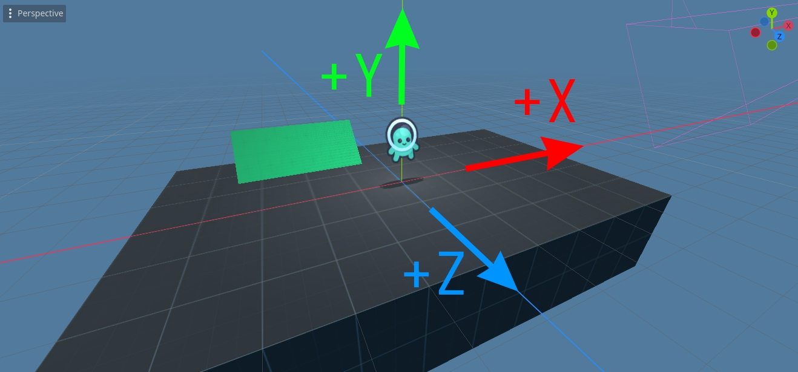

# Physics

Even though Super Tux Smash is a 3D game, its gameplay is 2D.

## Coordinate system

* `X-` is left.
* `X+` is right.
* `Y-` is down.
* `Y+` is up.
* `Z+` is towards camera.
* `Z-` is towards background.

Thus, the coordinate system is right-handed (same as Godot).

